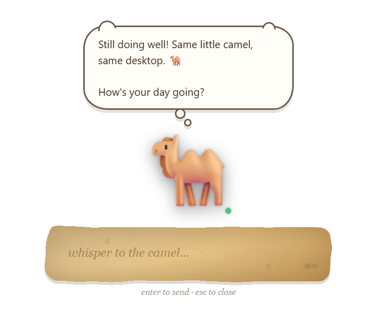
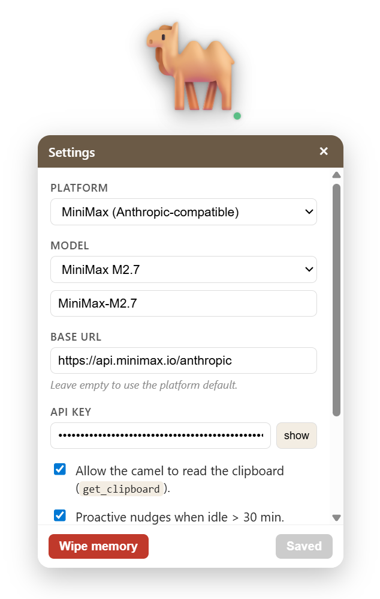
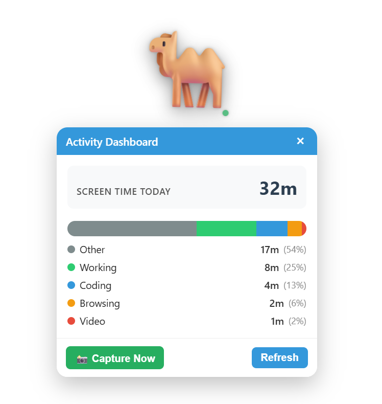

# Camel Pet

A desktop pet that is also a [CAMEL-AI](https://github.com/camel-ai/camel) `ChatAgent`. Floats on your desktop as a transparent, always-on-top companion: every interaction with the pet is an interaction with an LLM-backed agent that has memory, tools, and a personality.

<p align="center">
  
  
  
</p>

---

## What it does

| Interaction | Behavior |
|---|---|
| **Idle** | Camel breathes gently on top of your other windows. Draggable anywhere on screen. Every so often a tiny speech cloud drifts out with a random thought. |
| **Left-click** | Opens the **Activity Dashboard** below the pet — today's screen-time breakdown by category (coding, browsing, meetings, etc.), sourced from the optional screen-monitor tool. |
| **Right-click** | Opens the **Settings** panel below the pet — swap model, paste an API key, toggle tools, tune the monitor interval. |
| **Double-click** | Rolls a small parchment paper down below the pet. Type directly on the parchment, press Enter (or the quill icon) to send. The camel's reply streams back page-by-page in a speech cloud above its head. |
| **Click-through** | The transparent window is normally pass-through: clicks on empty space go to whatever app is underneath. Clicks on the camel, the active speech cloud, or an open panel are captured as you'd expect. |
| **Tray icon** | Left-click toggles pet visibility. Menu has Show / Hide / Quit. Closing the window hides to tray rather than exiting. |
| **Proactive** | If enabled, the camel nudges you after 30 min of idle time. Timers it sets (`set_timer` tool) fire as speech-cloud events when they elapse. |

### Features

- **Transparent, frameless, always-on-top** window with **click-through** — the pet behaves like a mascot sitting on your desktop, not like a normal app window that eats every click in its bounding box. Only the camel, an open panel, and the active speech cloud capture clicks.
- **Sequential speech-cloud replies** — the camel answers in small cartoon clouds above its head. Long replies paginate into multiple clouds automatically, each held on screen long enough to read, with a brief pop/fade between pages. A small thinking indicator shows while waiting for the first token.
- **Parchment input** — double-click rolls down a small aged-parchment paper you type directly on (no visible text box), with a quill send button. Esc or click-away closes it.
- **Activity Dashboard** — left-click opens a below-pet panel showing today's screen-time broken down by category (coding / working / browsing / reading / meeting / etc.). Populated by the optional screen-monitor, which captures the screen on a configurable interval and classifies what you're doing.
- **Persistent memory** — chat history is stored in SQLite at `%APPDATA%/CamelPet/memory.db` (macOS/Linux paths below). The camel picks up where you left off across restarts. One-click wipe from Settings.
- **Tools the agent can call** (CAMEL-AI function-calling):
  - `set_timer(seconds, message)` — schedules a delayed nudge that surfaces in the speech cloud when it fires.
  - `get_clipboard()` — opt-in, gated by a Settings toggle.
  - `capture_screenshot()` — captures and downsizes the current screen for the agent to analyze.
  - `get_activity_summary()` — reports today's activity breakdown, same data the dashboard shows.
- **Model switching at runtime** — Haiku 4.5 (fast), Sonnet 4.6 (balanced), Opus 4.7 (smart), or a custom model name. Platforms: Anthropic, MiniMax (Anthropic-compatible), OpenAI-compatible. API key can come from `agent/.env` or be pasted into Settings.
- **Personality** — baked-in system prompt makes the camel terse, curious, lightly sarcastic, occasionally desert-referential. Editable in `agent/camel_pet_agent/personality.py`.
- **Streaming** — tokens arrive over a local WebSocket and stream into the current speech cloud in real time; when a cloud fills up, the next page pops in.
- **Local-first, no telemetry** — the sidecar binds to `127.0.0.1` only, nothing leaves your machine except the LLM call itself.

### Not in v1

No multi-pet mode, no cloud sync, no mobile build, no skin marketplace, no voice (stretch goal).

---

## How it works

```
┌────────────────────────────────────────────────────────┐
│                 Tauri shell (Rust)                      │
│  ┌──────────────────────────────────────────────────┐  │
│  │             Webview (Vue 3 + TS + Pinia)          │  │
│  │   PetCanvas · Speech-cloud · ScrollInput          │  │
│  │   SettingsPanel · ActivityDashboard               │  │
│  └─────────────────────┬────────────────────────────┘  │
│                        │ ws://127.0.0.1:8765/ws         │
│  ┌─────────────────────┴────────────────────────────┐  │
│  │              Python sidecar (FastAPI)             │  │
│  │   CAMEL-AI ChatAgent                              │  │
│  │   · system prompt + personality                   │  │
│  │   · SQLite-backed memory (preloaded on boot)      │  │
│  │   · tools: set_timer, get_clipboard               │  │
│  │   · idle scheduler for proactive nudges           │  │
│  └───────────────────────────────────────────────────┘  │
└────────────────────────────────────────────────────────┘
```

- The **Tauri shell** owns the transparent window, the system tray, window-close-to-tray behavior, and spawning the Python sidecar in release builds.
- The **Vue UI** renders the camel sprite, chat bubble, and settings panel, and speaks to the sidecar over a WebSocket with a typed message surface (`user`, `config`, `clear_history`, `cancel_timer`, `list_timers`; server replies with `ready`, `token`, `done`, `error`, `timer_fired`, `nudge`, `config_ack`, `history_cleared`).
- The **Python sidecar** wraps a CAMEL-AI `ChatAgent`, persists every turn to SQLite, preloads recent history into CAMEL's in-process memory on startup, and exposes tools to the agent via CAMEL's function-calling interface.

---

## Project structure

```
camel_pet/
├── README.md                      ← this file
├── package.json / vite.config.ts  ← Vue 3 + Vite workspace
├── tsconfig*.json / index.html
│
├── src/                           ← Vue 3 + TypeScript UI
│   ├── main.ts                    ← app bootstrap (+ Pinia)
│   ├── App.vue                    ← root shell, event routing
│   ├── components/
│   │   ├── PetCanvas.vue          ← camel sprite + left/right/double-click gestures
│   │   ├── ScrollInput.vue        ← parchment paper input (double-click)
│   │   ├── ActivityDashboard.vue  ← screen-time breakdown (left-click)
│   │   └── SettingsPanel.vue      ← model / API key / tool toggles (right-click)
│   ├── stores/config.ts           ← Pinia store (localStorage-persisted)
│   └── services/agentSocket.ts    ← typed WebSocket client
│
├── src-tauri/                     ← Rust shell
│   ├── Cargo.toml / build.rs
│   ├── rust-toolchain.toml        ← pins Rust 1.86
│   ├── tauri.conf.json            ← base config (dev)
│   ├── tauri.release.conf.json    ← overlay adding externalBin for packaging
│   ├── capabilities/default.json  ← window + shell permissions
│   └── src/
│       ├── main.rs · lib.rs       ← entry + Tauri builder
│       ├── sidecar.rs             ← spawns the Python agent binary
│       └── tray.rs                ← system tray menu
│
└── agent/                         ← Python sidecar
    ├── pyproject.toml / poetry.lock
    ├── build.py                   ← PyInstaller driver
    └── camel_pet_agent/
        ├── __main__.py · server.py ← FastAPI app + /ws + /activity/today
        ├── agent.py               ← CAMEL-AI ChatAgent wrapper
        ├── memory.py              ← SQLite chat history
        ├── personality.py         ← system prompt
        ├── scheduler.py           ← idle nudge loop
        └── tools/
            ├── clipboard.py       ← get_clipboard
            ├── timer.py           ← set_timer (thread-safe loop hop)
            ├── screen.py          ← capture_screenshot (periodic / on demand)
            └── activity.py        ← screen-monitor store + get_activity_summary
```

---

## Prerequisites

- **Node.js** 18+ and **npm**.
- **Python** 3.11 or 3.12, **Poetry** 2.x.
- **Rust** 1.86+ (`rust-toolchain.toml` pins this; rustup fetches it on first `cargo` run).
- Platform webview toolchain:
  - Windows — WebView2 (ships with Windows 10+).
  - macOS — Xcode CLI tools.
  - Linux — `webkit2gtk-4.1`, `libayatana-appindicator3-dev`, etc. See [Tauri prerequisites](https://v2.tauri.app/start/prerequisites/).
- An **Anthropic API key** (or swap the CAMEL backend).

---

## First-time setup

```bash
# Frontend
npm install

# Agent
cd agent
poetry install
cd ..

# API key — either put it in agent/.env
printf "ANTHROPIC_API_KEY=sk-ant-...\nCAMEL_PET_MODEL=claude-haiku-4-5\n" > agent/.env
# ...or paste it into Settings at runtime (right-click the pet).
```

---

## Running in dev

Two terminals. Tauri hot-reloads both Vue and Rust; uvicorn hot-reloads Python.

```bash
# Terminal 1 — Python agent
cd agent
poetry run uvicorn camel_pet_agent.server:app --reload --port 8765
```

```bash
# Terminal 2 — Tauri + Vue
npm run tauri dev
```

The Tauri shell also *tries* to spawn a bundled `camel-agent` sidecar on startup; in dev that binary doesn't exist yet, so the shell logs a warning and defers to your manually-run uvicorn. This is intentional.

**Interacting with the pet:**

- Drag anywhere on the camel to move it.
- **Left-click** → Activity Dashboard (below the pet).
- **Right-click** → Settings (below the pet).
- **Double-click** → parchment paper; type directly on it and press Enter to send. Replies appear as speech clouds above the pet (long replies paginate across multiple clouds). Esc or click-away closes the parchment.
- Empty space around the pet stays click-through — you can still hit the apps underneath.
- The dot on the camel's shoulder is green when the WebSocket is live, red when not.
- Left-click the tray icon to toggle visibility.

---

## Testing the backend (no frontend)

The `agent/test_cli.py` helper lets you chat with the sidecar without launching Tauri/Vue. Two modes:

### Direct mode — no server, in-process agent

Fastest way to verify your `.env` (API key, model, base URL) actually talks to the provider. Builds a `CamelPetAgent` in-process and drops you into a REPL.

```bash
cd agent
poetry run python test_cli.py
# one-shot:
poetry run python test_cli.py --once "hello camel"
```

REPL commands: `/quit` to exit, `/reset` to clear the in-memory history for this session.

### WebSocket mode — full server path

Boots the real FastAPI server and talks to it over `ws://127.0.0.1:8765/ws`, exercising the same code path the Vue frontend uses (`ready` / `token` / `done` / `error` messages).

```bash
# Terminal 1 — server
cd agent
poetry run uvicorn camel_pet_agent.server:app --port 8765

# Terminal 2 — client
cd agent
poetry run python test_cli.py --mode ws
# or point at a different host/port:
poetry run python test_cli.py --mode ws --url ws://127.0.0.1:8765/ws
```

A quick liveness check without the REPL:

```bash
curl http://127.0.0.1:8765/health
```

Both modes load `agent/.env`, so switching between Anthropic and an OpenAI-compatible backend (e.g. Kimi via `taotoken.net`) is just a matter of toggling `CAMEL_PET_PLATFORM` in that file.

---

## Production build

```bash
# 1. Freeze the Python agent. This writes
#    agent/dist/camel-agent-<triple>(.exe) and copies it to
#    src-tauri/binaries/.
cd agent
poetry run python build.py
cd ..

# 2. Build the installer, merging the externalBin overlay.
npm run tauri build -- --config src-tauri/tauri.release.conf.json
```

Output: `src-tauri/target/release/bundle/` (`.msi` on Windows, `.dmg` on macOS, `.AppImage`/`.deb` on Linux). Target bundle size is ~80 MB — watch CAMEL-AI transitive deps, only install the model backends you ship.

---

## Configuration

| Surface | What you can change |
|---|---|
| `agent/.env` | `ANTHROPIC_API_KEY`, `CAMEL_PET_MODEL`, `CAMEL_PET_PORT` (default 8765). For OpenAI-compatible endpoints: `CAMEL_PET_PLATFORM=openai_compatible`, `OPENAI_COMPATIBLE_API_KEY`, `OPENAI_COMPATIBLE_BASE_URL`. |
| In-app Settings panel | Platform, model (preset or custom), base URL, API key, clipboard tool toggle, idle-nudge toggle, screen-monitor toggle + capture interval (10–3600 s). Persisted to browser localStorage and pushed to the sidecar over the WebSocket. |
| `agent/camel_pet_agent/personality.py` | The camel's system prompt / voice. |
| Memory database | `%APPDATA%/CamelPet/memory.db` on Windows, `~/Library/Application Support/CamelPet/memory.db` on macOS, `$XDG_DATA_HOME/CamelPet/memory.db` on Linux. Wipe via Settings → "Wipe memory". |

---

## Privacy and security

- No telemetry. The app makes exactly one class of outbound call: your LLM provider.
- The sidecar binds to `127.0.0.1` only, on an ephemeral port (8765 by default in dev).
- Tools that can touch user data (clipboard) are off by default and gated by explicit toggles.
- Chat history is local, in SQLite, wipeable with one click.
- API keys from `.env` stay in the sidecar process; keys entered via Settings live in the browser's localStorage and the sidecar's memory.

---

## Troubleshooting

- **`cargo check` fails with `edition2024` / rustc version** — run `rustup update stable`. The `rust-toolchain.toml` should auto-fetch 1.86 on next `cargo` invocation.
- **`resource path binaries\camel-agent-...exe doesn't exist`** during `tauri build` — you used the release overlay but haven't run `agent/build.py` yet.
- **Red dot on the pet (disconnected)** — the sidecar isn't running. Check the uvicorn terminal, or `curl http://127.0.0.1:8765/health`.
- **First message errors with `ANTHROPIC_API_KEY not set`** — set it in `agent/.env`, or paste into Settings and click Apply.
- **PyInstaller cold start feels slow in release** — a 2–4 s first-launch delay is normal; the Tauri window shows the idle camel while the sidecar boots.

---

## License

Apache-2.0.
